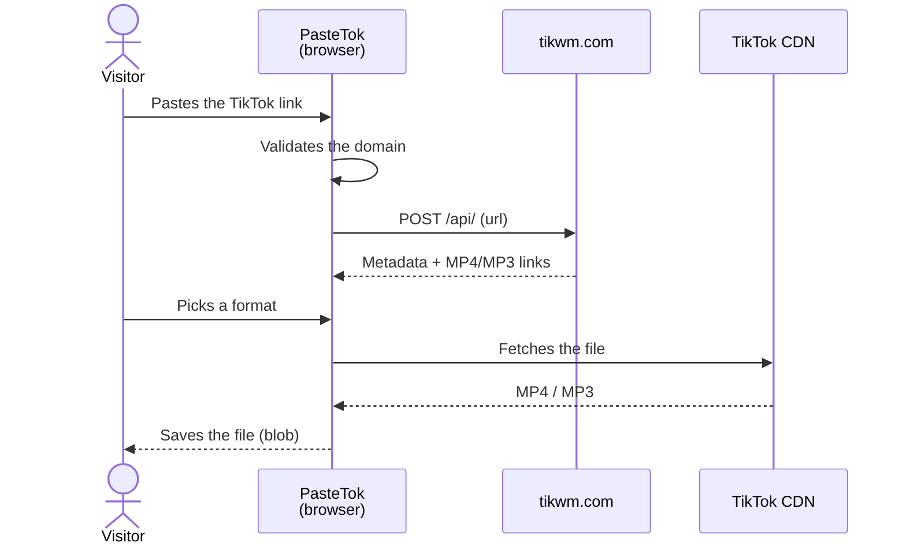

<div align="center">

# PasteTok

**Download any public TikTok video as MP4 without watermark, with watermark, or as MP3.**
Free · No sign-up · No ads · No cookies · No server · English & French

### [▶ Try it: trk78.github.io/pastetok](https://trk78.github.io/pastetok/)

[](https://github.com/trk78/pastetok/actions/workflows/deploy.yml)
[](LICENSE)


</div>

---

## ✨ Features

| | |
|---|---|
| 🎬 **3 formats** | MP4 without watermark (recommended), MP4 with watermark, MP3 (audio only) |
| 👀 **Preview** | Thumbnail, title, author, duration, likes and views before downloading |
| 🔒 **Zero data collected** | No server, no database, no cookies, no trackers |
| 📱 **Mobile-first** | Built for phones, where TikTok links get copied |
| ⚡ **Fast** | Static site served by GitHub's CDN, ~90 kB of JS on first load |
| 🔗 **Every link format** | `tiktok.com`, `www.`, `m.`, short links `vm.` / `vt.tiktok.com` |
| 🌍 **Bilingual** | French at `/pastetok/`, English at `/pastetok/en/`, each pre-rendered with its own `hreflang` alternates |

## ⚙️ How it works

PasteTok has **no backend**: it is a static Next.js export, and everything runs in the visitor's browser.



1. The pasted URL is validated client-side (TikTok domains only): [`lib/security.ts`](lib/security.ts).
2. The browser queries the public, keyless [tikwm.com](https://www.tikwm.com) API, which returns direct links: [`lib/tiktok.ts`](lib/tiktok.ts).
3. The file is fetched **directly** from the TikTok CDN, then saved under a clean name (`tiktok_<id>_nowm.mp4`).

No proxy is needed because both tikwm **and** the TikTok CDN return `Access-Control-Allow-Origin: *`. If a download still fails, the file opens in a new tab so it can be saved manually.

## 🚀 Run locally

Requirements: Node.js 20+.

```bash
git clone https://github.com/trk78/pastetok.git
cd pastetok
npm install
npm run dev
```

Open **[localhost:3000/pastetok](http://localhost:3000/pastetok)**: the site is served under the `/pastetok` `basePath`, just like on GitHub Pages.

| Command | Effect |
|---|---|
| `npm run dev` | Development server |
| `npm run build` | Static export to `out/` |
| `npm run lint` | ESLint |

### Environment variables (optional)

| Variable | Default | Purpose |
|---|---|---|
| `NEXT_PUBLIC_SITE_URL` | `https://trk78.github.io/pastetok` | Canonical URL, Open Graph, sitemap |
| `NEXT_PUBLIC_SITE_NAME` | `PasteTok` | Name used in metadata |

## 🌍 Host your own copy

1. **Fork** the repository.
2. If the repository is no longer named `pastetok`, update `basePath` in [`next.config.mjs`](next.config.mjs) (and `NEXT_PUBLIC_SITE_URL`). With a custom domain at the root, remove `basePath`.
3. **Settings → Pages → Source: GitHub Actions**.
4. Push to `main`: [`.github/workflows/deploy.yml`](.github/workflows/deploy.yml) builds and publishes automatically.

Since `out/` is fully static, it can also be deployed as-is to Cloudflare Pages, Netlify, Vercel or any file server.

## 🗂️ Project structure

```
├── app/
│   ├── (fr)/                    — French routes (root layout + thin pages)
│   ├── (en)/en/                 — English routes (root layout + thin pages)
│   └── sitemap.ts               — Both languages, with hreflang alternates
├── components/
│   ├── views/                   — Page content shared by both languages
│   ├── legal/                   — Legal notice, terms, privacy (FR + EN text)
│   ├── home/                    — HeroSection, HowItWorks, FAQ
│   ├── download/                — VideoPreview, DownloadOptions
│   └── layout/                  — RootShell, Header, Footer, LangSwitch
├── lib/
│   ├── i18n.ts                  — UI strings + localized routes (add a language here)
│   ├── seo.ts                   — Per-page metadata, canonical + hreflang
│   ├── tiktok.ts                — tikwm client + download (swap the provider here)
│   └── security.ts              — URL validation, input sanitizing
├── next.config.mjs              — output: 'export', basePath
└── .github/workflows/deploy.yml — GitHub Pages build + deploy
```

## ⚠️ Known limitations

- **Depends on tikwm.com**: if the API goes down, closes its CORS or becomes paid, extraction stops working. The entry point to replace is `fetchTikTokVideo()` in [`lib/tiktok.ts`](lib/tiktok.ts).
- **Private or deleted videos** can't be retrieved.

## 🤝 Contributing

Issues and pull requests are welcome: [open an issue](https://github.com/trk78/pastetok/issues).

Open ideas:
- fallback provider when tikwm is unavailable;
- mobile navigation menu (header links are hidden below `md`);
- Open Graph image;
- more languages (strings and routes live in [`lib/i18n.ts`](lib/i18n.ts)).

## ⚖️ Disclaimer

PasteTok is a technical tool meant for **personal use**. It does not host, store or redistribute any video. Content remains the property of its creators: respect copyright and [TikTok's Terms of Service](https://www.tiktok.com/legal/terms-of-service). Independent project, not affiliated with TikTok or ByteDance.

## 📄 License

[MIT](LICENSE) © Timéo Jeannin
