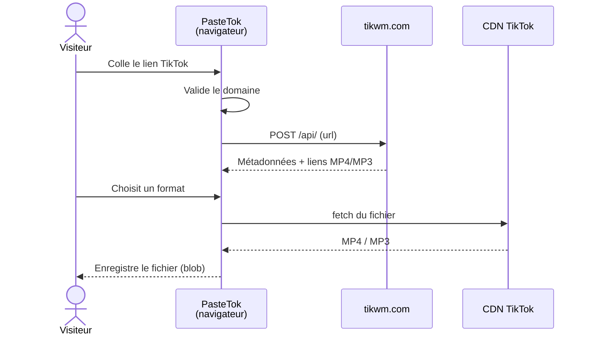

<div align="center">

# PasteTok

**Téléchargez n'importe quelle vidéo TikTok publique en MP4 sans filigrane, avec filigrane ou en MP3.**
Gratuit · Sans inscription · Sans pub · Sans cookie · Sans serveur

### [▶ Essayer : timeojea.github.io/pastetok](https://timeojea.github.io/pastetok/)

[](https://github.com/timeojea/pastetok/actions/workflows/deploy.yml)
[](LICENSE)


</div>

---

## ✨ Fonctionnalités

| | |
|---|---|
| 🎬 **3 formats** | MP4 sans filigrane (recommandé), MP4 avec filigrane, MP3 (bande son seule) |
| 👀 **Aperçu** | Miniature, titre, auteur, durée, likes et vues avant de télécharger |
| 🔒 **Zéro donnée collectée** | Pas de serveur, pas de base, pas de cookie, pas de tracker |
| 📱 **Mobile-first** | Pensé pour le téléphone, où l'on copie les liens TikTok |
| ⚡ **Rapide** | Site statique servi par le CDN de GitHub, ~90 Ko de JS au premier chargement |
| 🔗 **Tous les liens** | `tiktok.com`, `www.`, `m.`, liens courts `vm.` / `vt.tiktok.com` |

## ⚙️ Comment ça marche

PasteTok n'a **aucun backend** : c'est un export statique de Next.js, et tout se passe dans le navigateur du visiteur.



1. L'URL collée est validée côté client (domaines TikTok uniquement) : [`lib/security.ts`](lib/security.ts).
2. Le navigateur interroge l'API publique [tikwm.com](https://www.tikwm.com), sans clé, qui renvoie les liens directs : [`lib/tiktok.ts`](lib/tiktok.ts).
3. Le fichier est récupéré **directement** depuis le CDN TikTok, puis enregistré sous un nom propre (`tiktok_<id>_nowm.mp4`).

Ça fonctionne sans proxy parce que tikwm **et** le CDN TikTok renvoient `Access-Control-Allow-Origin: *`. Si un téléchargement échoue quand même, le fichier s'ouvre dans un nouvel onglet pour être enregistré à la main.

## 🚀 Lancer en local

Prérequis : Node.js 20+.

```bash
git clone https://github.com/timeojea/pastetok.git
cd pastetok
npm install
npm run dev
```

Ouvrir **[localhost:3000/pastetok](http://localhost:3000/pastetok)** : le site est servi sous le `basePath` `/pastetok`, comme sur GitHub Pages.

| Commande | Effet |
|---|---|
| `npm run dev` | Serveur de développement |
| `npm run build` | Export statique dans `out/` |
| `npm run lint` | ESLint |

### Variables d'environnement (optionnelles)

| Variable | Défaut | Rôle |
|---|---|---|
| `NEXT_PUBLIC_SITE_URL` | `https://timeojea.github.io/pastetok` | URL canonique, Open Graph, sitemap |
| `NEXT_PUBLIC_SITE_NAME` | `PasteTok` | Nom affiché dans les métadonnées |

## 🌍 Héberger votre propre copie

1. **Forkez** le dépôt.
2. Si le dépôt ne s'appelle plus `pastetok`, adaptez `basePath` dans [`next.config.mjs`](next.config.mjs) (et `NEXT_PUBLIC_SITE_URL`). Avec un domaine perso à la racine, supprimez `basePath`.
3. **Settings → Pages → Source : GitHub Actions**.
4. Poussez sur `main` : [`.github/workflows/deploy.yml`](.github/workflows/deploy.yml) build et publie automatiquement.

Le dossier `out/` étant 100 % statique, il se déploie aussi tel quel sur Cloudflare Pages, Netlify, Vercel ou n'importe quel serveur de fichiers.

## 🗂️ Structure

```
├── app/
│   ├── page.tsx                 — Accueil (saisie du lien)
│   ├── download/page.tsx        — Aperçu + choix du format
│   ├── contact/, cgu/, …        — Pages secondaires et légales
│   └── sitemap.ts
├── components/
│   ├── home/                    — HeroSection, HowItWorks, FAQ
│   ├── download/                — VideoPreview, DownloadOptions
│   └── layout/                  — Header, Footer
├── lib/
│   ├── tiktok.ts                — Client tikwm + téléchargement (changer de fournisseur ici)
│   └── security.ts              — Validation d'URL, nettoyage des entrées
├── next.config.mjs              — output: 'export', basePath
└── .github/workflows/deploy.yml — Build + déploiement GitHub Pages
```

## ⚠️ Limites connues

- **Dépendance à tikwm.com** : si l'API tombe, ferme son CORS ou devient payante, l'extraction ne fonctionne plus. Le point d'entrée à remplacer est `fetchTikTokVideo()` dans [`lib/tiktok.ts`](lib/tiktok.ts).
- **Vidéos privées ou supprimées** : non récupérables.
- **Interface en français uniquement.**

## 🤝 Contribuer

Issues et pull requests bienvenues : [ouvrir une issue](https://github.com/timeojea/pastetok/issues).

Pistes ouvertes :
- fournisseur de secours si tikwm est indisponible ;
- menu de navigation sur mobile (les liens du header sont masqués sous `md`) ;
- image Open Graph (`public/og-image.png`, référencée mais absente) ;
- version anglaise.

## ⚖️ Avertissement

PasteTok est un outil technique destiné à un **usage personnel**. Il n'héberge, ne stocke et ne redistribue aucune vidéo. Les contenus restent la propriété de leurs créateurs : respectez les droits d'auteur et les [conditions d'utilisation de TikTok](https://www.tiktok.com/legal/terms-of-service). Projet indépendant, sans lien avec TikTok ou ByteDance.

## 📄 Licence

[MIT](LICENSE) © Timéo Jeannin
